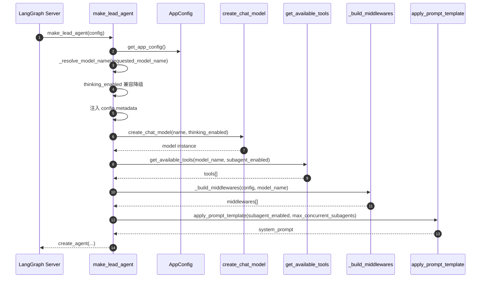
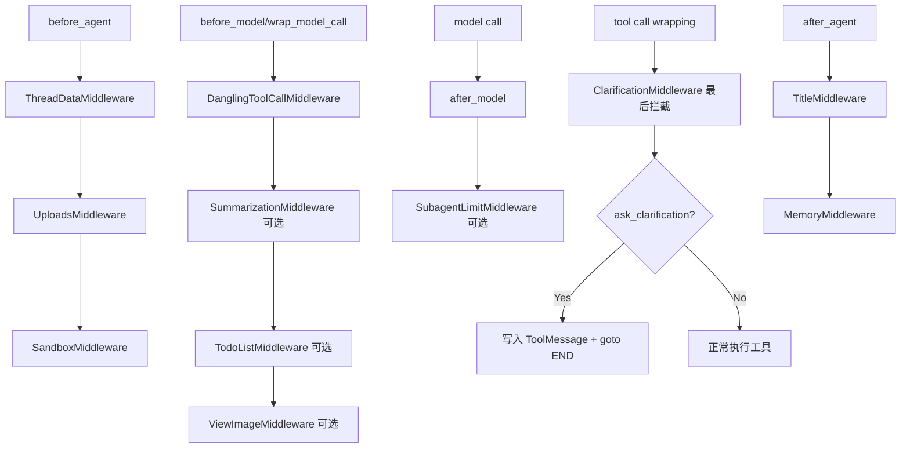

# make_lead_agent 调用时序图

本文给出 `make_lead_agent` 的关键运行时链路，帮助快速定位「请求参数 -> 组装 -> 模型/工具/中间件执行」全过程。

## 1. 初始化与装配时序

## 2. 单轮执行生命周期（中间件视角）

## 3. 请求参数影响矩阵

| configurable 参数 | 影响点 | 直接结果 |
|---|---|---|
| `model_name` / `model` | 模型解析 | 决定最终模型与 vision 判定 |
| `thinking_enabled` | 模型创建 | 不支持 thinking 时自动降级 |
| `is_plan_mode` | 中间件 | 决定是否注入 `TodoListMiddleware` |
| `subagent_enabled` | 工具 + 中间件 + prompt | 决定 `task` 工具、并发限制、子代理提示区 |
| `max_concurrent_subagents` | prompt + 限流中间件 | 提示词使用原值；中间件会 clamp 到 `[2,4]` |

## 4. 常见问题定位

1. `task` 工具不出现：检查 `subagent_enabled` 是否为 `true`。  
2. `view_image` 不出现：检查当前模型 `supports_vision`。  
3. 首轮即失败：检查 `runtime.context.thread_id` 是否传入。  
4. 澄清后流程停止：这是 `ClarificationMiddleware` 的 `goto END` 设计行为。  
